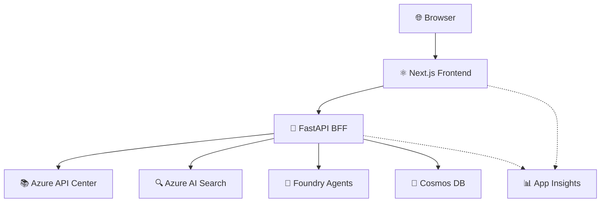

# APIC Vibe Portal AI

An **AI-powered API portal** built on Azure services, designed to help developers discover, understand, and use APIs faster through multi-agent AI assistance.

> **Status**: ✅ All three phases delivered — MVP, Governance + Compare, Analytics & Polish

## ✨ Features

### Phase 1 — Core Portal (MVP)

| Feature            | Description                                                                               |
| ------------------ | ----------------------------------------------------------------------------------------- |
| **API Catalog**    | Browse, filter, sort, and paginate all APIs registered in Azure API Center                |
| **API Detail**     | View API metadata, versions, OpenAPI specification, and deployment environments           |
| **Hybrid Search**  | Semantic + keyword search powered by Azure AI Search with facets and relevance scoring    |
| **AI Assistant**   | Chat with an AI assistant (Azure OpenAI + Foundry Agents) to discover and understand APIs |
| **Authentication** | Entra ID (Azure AD) authentication with RBAC roles (User / Maintainer / Admin)            |
| **Observability**  | Application Insights telemetry for frontend and BFF                                       |

### Phase 2 — Governance + Compare

| Feature                       | Description                                                                        |
| ----------------------------- | ---------------------------------------------------------------------------------- |
| **Governance Dashboard**      | Overall compliance scores, score distribution, and trends across all APIs          |
| **Compliance Detail**         | Per-API governance checks with severity levels and actionable recommendations      |
| **API Comparison**            | Side-by-side comparison of up to 4 APIs with AI analysis                           |
| **Multi-Agent Orchestration** | Orchestrator dispatches queries to specialist agents (Search, Governance, Catalog) |
| **Agent Management**          | Admin UI to view, test, and manage AI agents                                       |
| **Security Trimming**         | Role-based filtering of catalog results                                            |

### Phase 3 — Analytics & Polish

| Feature                      | Description                                                                       |
| ---------------------------- | --------------------------------------------------------------------------------- |
| **Analytics Dashboard**      | Portal usage metrics (page views, search queries, chat interactions, user trends) |
| **Top APIs**                 | Most-viewed and most-searched APIs with trend data                                |
| **Search Analytics**         | Top search terms and no-results queries                                           |
| **Metadata Completeness**    | Scoring and recommendations for improving API catalog quality                     |
| **Performance Optimization** | Web Vitals optimization, code splitting, image optimization                       |
| **Accessibility**            | WCAG 2.1 AA compliance across all pages                                           |

## 🏗️ Architecture



**Components:**

- **Frontend**: Next.js 16 SPA with TypeScript 6.0
- **BFF**: Python 3.14 + FastAPI backend (managed with UV)
- **AI Layer**: Azure OpenAI + Foundry Agent Service
- **Search**: Azure AI Search (hybrid search)
- **Catalog**: Azure API Center
- **Persistence**: Azure Cosmos DB (serverless)
- **Observability**: Azure Application Insights
- **Deployment**: Azure Container Apps

For detailed architecture, see [docs/project/apic_architecture.md](docs/project/apic_architecture.md).

## 🚀 Getting Started

### Prerequisites

- **Node.js** >= 24 (see `.nvmrc`)
- **Python** 3.14 (see `.python-version`)
- **UV** (Python package manager) — [Install UV](https://github.com/astral-sh/uv)
- **npm** >= 10
- **Azure CLI** (for deployment)

### Installation

1. **Clone the repository**

   ```bash
   git clone https://github.com/christopherhouse/APIC-Vibe-Portal.git
   cd APIC-Vibe-Portal
   ```

2. **Install frontend and shared dependencies**

   ```bash
   npm install
   ```

3. **Install BFF dependencies**
   ```bash
   cd src/bff
   uv sync
   cd ../..
   ```

### Development

#### Run Frontend (Next.js)

```bash
npm run dev --workspace=@apic-vibe-portal/frontend
```

#### Run BFF (FastAPI)

```bash
cd src/bff
uv run fastapi dev
```

#### Lint

```bash
# Frontend + Shared
npm run lint

# BFF
cd src/bff
uv run ruff check .
```

#### Format

```bash
# Frontend + Shared
npm run format

# BFF
cd src/bff
uv run ruff format .
```

#### Test

```bash
# Frontend + Shared
npm run test

# BFF
cd src/bff
uv run pytest
```

#### Build

```bash
# Frontend + Shared
npm run build
```

## 📂 Repository Structure

```
/
├── src/
│   ├── frontend/          # Next.js 16 SPA
│   ├── bff/               # Python 3.14 + FastAPI BFF
│   └── shared/            # Shared TypeScript types/utilities
├── infra/                 # Bicep IaC templates
├── .github/
│   ├── workflows/         # CI/CD pipelines
│   ├── copilot-instructions.md
│   ├── agents/            # Custom Copilot agents
│   ├── copilot/
│   │   └── mcp.json       # MCP server configuration
│   └── PULL_REQUEST_TEMPLATE.md
├── docs/
│   └── project/           # Project documentation
├── scripts/               # Developer helper scripts
├── .editorconfig
├── .gitignore
├── .nvmrc                 # Node.js version (24)
├── .python-version        # Python version (3.14)
├── package.json           # Root workspace config
└── README.md
```

## 📚 Documentation

### User Guides

- **[Getting Started](docs/user-guide/getting-started.md)** — Quick start for new users
- **[Searching for APIs](docs/user-guide/searching-apis.md)** — Search tips and techniques
- **[Using the AI Chat](docs/user-guide/using-ai-chat.md)** — AI assistant guide
- **[Comparing APIs](docs/user-guide/comparing-apis.md)** — Side-by-side comparison guide
- **[Understanding Governance](docs/user-guide/understanding-governance.md)** — Compliance scores explained

### Operations

- **[Deployment Guide](docs/operations/deployment-guide.md)** — Deployment procedures
- **[Monitoring Runbook](docs/operations/monitoring-runbook.md)** — Monitoring and alerting
- **[Incident Response](docs/operations/incident-response.md)** — Incident handling procedures
- **[Scaling Guide](docs/operations/scaling-guide.md)** — Scaling Container Apps
- **[Backup & Recovery](docs/operations/backup-recovery.md)** — Data backup and recovery
- **[Troubleshooting](docs/operations/troubleshooting.md)** — Common issues and solutions

### Developer Documentation

- **[Architecture Deep Dive](docs/development/architecture-deep-dive.md)** — Detailed component architecture
- **[Local Development](docs/development/local-development.md)** — Local dev setup guide
- **[Testing Guide](docs/development/testing-guide.md)** — Testing strategy and how-to
- **[Agent Development](docs/development/agent-development.md)** — How to create new AI agents
- **[Contributing Guide](docs/development/contributing.md)** — Contribution guidelines

### Project Documentation

- **[Product Charter](docs/project/apic_product_charter.md)** — Vision, goals, and timeline
- **[Architecture](docs/project/apic_architecture.md)** — Component overview and design
- **[Product Spec](docs/project/apic_portal_spec.md)** — Feature requirements
- **[Implementation Plan](docs/project/plan/README.md)** — Phased development plan (all 32 tasks ✅)

## 🔧 Tech Stack

### Frontend

- Next.js 16 (App Router)
- React 19
- TypeScript 6.0 (strict mode)
- Material UI (MUI) — component library, theming, and styling
- ESLint + Prettier
- Jest + React Testing Library + Playwright

### Backend (BFF)

- Python 3.14
- FastAPI
- UV (package manager)
- Ruff (linting + formatting)
- pytest

### Azure Services

- Azure API Center
- Azure AI Search
- Azure OpenAI
- Foundry Agent Service
- Azure Cosmos DB (serverless)
- Azure Container Apps
- Azure Application Insights
- Azure Key Vault
- Azure Container Registry

## 🤖 GitHub Copilot Integration

This project includes custom GitHub Copilot agents and instructions:

- **Copilot Instructions**: [.github/copilot-instructions.md](.github/copilot-instructions.md)
- **Custom Agents**:
  - `api-portal-architect` — Architecture and design decisions
  - `azure-infra-agent` — Bicep templates and Azure resources
  - `frontend-agent` — Next.js and React development
  - `bff-agent` — FastAPI and Azure SDK integration
  - `tech-writer-agent` — Documentation writing

### MCP Servers

Available Model Context Protocol servers:

- **Microsoft Learn** — Azure SDK docs and best practices
- **Context7** — Up-to-date library documentation
- **Next.js DevTools** — Next.js development tooling
- **Snyk** — Security vulnerability scanning

## 🔒 Security

- **Authentication**: Entra ID (Azure AD)
- **Authorization**: RBAC with security trimming
- **Secrets**: Azure Key Vault (never commit secrets!)
- **Scanning**: Snyk for dependency vulnerabilities

## 🧪 Testing

- **Frontend**: Jest + React Testing Library (unit/component), Playwright (E2E)
- **BFF**: pytest (unit + integration)
- **Coverage Target**: >80% for business logic

## 🚢 Deployment

Deploy to Azure Container Apps via GitHub Actions:

1. Build Docker images for frontend and BFF
2. Push to Azure Container Registry
3. Deploy to Azure Container Apps
4. Infrastructure managed via Bicep templates

See `.github/workflows/` for CI/CD pipelines.

## 🤝 Contributing

1. Check the [implementation plan](docs/project/plan/README.md) for current tasks
2. Create a branch from `main`
3. Make changes following coding conventions (see `.github/copilot-instructions.md`)
4. Write tests for new functionality
5. Run linting and tests locally
6. Create a PR using the template

## 📝 License

See [LICENSE](LICENSE) for details.

---

**Built with ❤️ using Azure AI services**
